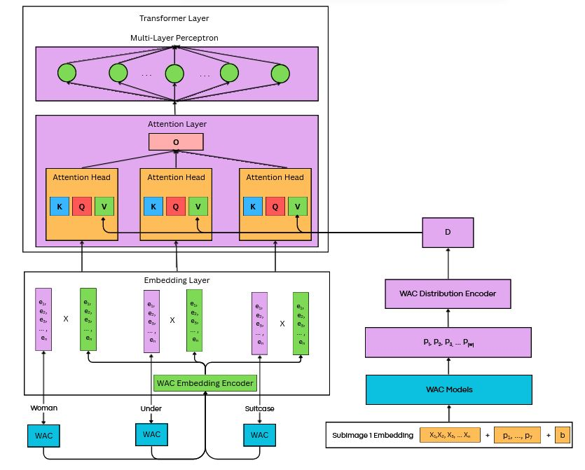

# Renaissance-WAC: A Multimodal Transformr Modeling Platform

Reanissance is a straight-forward modeling platform that allows the user to train and test a variety of vision-language model configurations with minimal programming requirements. The novel feature of this platform is that models from the Huggingface hub can be easily plugged into text and vision transformer modules. This allows users to easily test and train a huge variety of novel models with relatively little programming.   

## Model Types

Renaissance currently supports two types of encoder-only models: the one-tower encoder and the two-tower encoder. 

The one-tower encoder consists of an embedding layer, an encoder module and a output layer. The encoder module can be a drawn from number of transformer encoders available on the huggingface hub. Currently only BERT-style word-piece text embeddings and image patch embeddings are available. 


The two-tower encoder consists of a text-encoder, an image-encoder and a cross-modal fusion encoder
followed by an output layer. The text-encoder and the image-encoder can be drawn from a number of models available on huggingface. The fusion encoder is always manually configured and trained from scratch.


## WAC Information


WAC (words-as-classifiers) is an explicit symbol grounding system built to link single words to objects they represent. 

WAC consists of many binary classifiers trained on visual embeddings created from images of objects. These visual embeddings
are created from a separate object embedding model. These visual embeddings are then assembled into positive and negative
samples based on whether or not a word appears in a piece of text describing that object. 

In Renaissance-WAC, these WAC models are trained alongside a two-tower LM if they are enabled. Information from the WAC
models is injected into the text tower of the two-tower LM since WAC is a text-focused model. More specifically, word-based
embeddings from WAC and a probability distribution across all WAC models are injected into the text tower. The word based
embeddings are injected into the embedding layer of the text tower while the distributions are injected into specific 
matrices inside the attention heads of the text tower. This is done via element-wise multiplication. The WAC models are co-trained
alongside the two-tower LM for one epoch, using the same batch that is sent into the LM for training. The datasets are updated 
before the WAC models are trained. This is done to allow the WAC models and two-tower LM to incrementally learn information rather than
all at once, which more closely follows how humans learn language. (Note: This does not come close to actually modeling how humans learn
language, but it is a step in that direciton. )

The word-based WAC embeddings
contain per-word (local) information while the WAC distributions contain dataset-wide (global) information. This is done to enrich
the text tower with symbol grounding data during training. Since the WAC embeddings and distributions do not align element-wise
with the word embeddings and attention matrices in the text tower, two separate projection encoders are used to resize the embeddings
and distributions to enable element-wise multiplication to take place. Both the WAC embedding and distribution projection encoders 
consist of simple feed-forward networks comprised of linear layers followed by activation functions. These learnable auto-encoders 
function like a kind of neural-network based principal component analysis (PCA) to compress the WAC embeddings and distributions down
while preserving their information. 



A description of the settings to control how WAC works with Renaissance can be found below: 

### WAC distribution and embedding settings

- use_wac_embeddings
Enable/disable WAC embeddings

- use_position_data
Turn position data on or off for object feature embeddings

- wac_distribution_matrix
Set the attention matrix to multiply with WAC distributions 

- wac_image_encoder
HuggingFace Repo path to the object embedding model to use for RefCOCO

- use_wac_models_only
Disable two-tower MLM for testing (does not work currently)

- pretrained_wac_embedding_file
File to use for pretrained WAC model embeddings. This must be to a local directory.
This should also be used for WAC model weights that are not trained using 
Renaissance-WAC for testing. 


### WAC projection autoencoder settings

- wac_embedding_act
Activation function to use for WAC embedding projection encoder.

- wac_embedding_encoder_sizes
Dimensions of linear layers to use in WAC embedding encoder 
Note: two more linear layers will be added in front of 
and behind this one in the autoencoder. The first linear layer
will project the WAC embeddings to the first size in this 
array and the last embedding layer will compress the last size
specified in this list down to the text model's embedding size.

- wac_distribution_act
Activation function for WAC distribution projection encoder

- wac_distribution_encoder_sizes
Dimensions of linear layers to use for the WAC distribution
projection encoder. Note that two more linear layers will
be added before and after this list. The first will compress
The WAC distribution embeddings down to the first size in this list 
and the last linear layer will compress from the last dimension in this
list down to the attention matrix size. 

- wac_distribution_weight
Weight of the WAC distribution injections to control how strong
the symbol grounding signal coming from these distributions is into
the attention matrices

- wac_distribution_encoder_location
Controls whether to use one WAC distribution encoder for all
attention layers in the text tower or to use a separate WAC distribution
encoder for each layer in the text tower. 

### WAC Model Settings

- position_size = 7
Size of the position data added to the object feature embeddings

- neg_to_pos 
Negative to positive sampling ratio

- wac_kwargs
Keyword arguments to send into the gradient-descent trained 
logistic regression classifier


- num_cores
Number of cores to use for multithreaded WAC model training 

- wac_repo_id
Huggingface repository ID to use if you want to save or load WAC models to 
their platform

- local_wac_directory
Local WAC directory to use for saving and loading WAC models between experiments

- save_wac_features
Flag to cache visual object embeddings created for the WAC module. 
Note: this should only be used during testing and should not be enabled
for full experiments using Renaissance WAC. 


## Install

```bash
pip install -r requirements.txt
pip install -e .
```

## Pre-trained Checkpoints

Here are the pre-trained models:


## Dataset Preparation

Dataset preperation and usage is described in DATA.md.

## Quiick Start Guide

To get the most out of this program users will need to adjust the model settings in the renaissance/config.py settings. CONFIGURING_MODELS.md provides a detailed explaination of how to use the config file. Below we have provided some simple examples using only the command line.

### Pretrain A One-Tower Model
There are two pretraining tasks available, masked language modeling (mlm) and image-text matching (itm). They can be run seperately or combined. The examples below run them together, to run them individually replace task_mlm_itm with task_mlm for masked lnaguage modeling or task itm for image_text matching. 

```bash
python run.py with task_mlm_itm encoder=<ENCODER> max_steps=<TRAINING_STEPS> num_gpus=<NUM_GPUS> num_nodes=<NUM_NODES> per_gpu_batchsize=<BS_FITS_YOUR_GPU> batch_size=<BATCH_SIZE> data_root=<ARROW_ROOT>
```
Here is an example. The command below will train a one-tower model with DINO-Small as the encoder. It will train for 50k steps and will use gradient accumulation to achieve the batch size of 256.

```bash
python3 run.py with task_mlm_itm encoder=facebook/dino-vits16 max_steps=50000 num_gpus=1 num_nodes=1 per_gpu_batchsize=32 batch_size=256 data_root=data/arrow/
```


### Pretrain A Two-Tower Model
```bash
python run.py with task_mlm_itm image_encoder=<IMAGE_ENCODER> text_encoder=<TEXT_ENCODER> cross_layer_hidden_size=<CROSS_LAYER_HIDDEN_SIZE> num_cross_layers=<NUM_CROSS_LAYER> max_steps=<TRAINING_STEPS> num_gpus=<NUM_GPUS> num_nodes=<NUM_NODES> per_gpu_batchsize=<BS_FITS_YOUR_GPU> batch_size=<BATCH_SIZE> data_root=<ARROW_ROOT>
```

Here is an example. The command below will train a two-tower model with DeiT-Tiny as the image encoder, ELECTRA-Small as the text-encoder, and a six layer cross-modal encoder with a hidden size of 256. It will train for 50k steps and will use gradient accumulation to achieve the batch size of 256.

```bash
python3 run.py with task_mlm_itm image_encoder=facebook/deit-tiny-patch16-224 text_encoder=google/electra-small-discriminator cross_layer_hidden_size=256 num_cross_layers=6 max_steps=50000 num_gpus=1 num_nodes=1 per_gpu_batchsize=32 batch_size=256 data_root=data/arrow/
``` 

## Finetuning and Evaluation

### NLVR2

```bash
export MASTER_ADDR=$DIST_0_IP
export MASTER_PORT=$DIST_0_PORT
export NODE_RANK=$DIST_RANK
python run.py with  task_finetune_nlvr2  load_path=<PRETRAINED_MODEL> image_encoder=<IMAGE_ENCODER> text_encoder=<TEXT_ENCODER> cross_layer_hidden_size=<CROSS_LAYER_HIDDEN_SIZE> num_cross_layers=<NUM_CROSS_LAYER>  image_size=<IMAGE_SIZE> per_gpu_batchsize=<BS_FITS_YOUR_GPU> num_gpus=<NUM_GPUS> num_nodes=<NUM_NODES> data_root=<ARROW_ROOT>
```

Here is an example:
```bash
python3 run.py with task_mlm_itm load_path=... image_encoder=facebook/deit-tiny-patch16-224 text_encoder=google/electra-small-discriminator cross_layer_hidden_size=256 image_size=288 num_cross_layers=6 per_gpu_batchsize=32 num_gpus=1 num_nodes=1 data_root=data/arrow/
```

### VQAv2

```bash
python run.py with task_finetune_vqa load_path=<PRETRAINED_MODEL> image_encoder=<IMAGE_ENCODER> text_encoder=<TEXT_ENCODER> cross_layer_hidden_size=<CROSS_LAYER_HIDDEN_SIZE> num_cross_layers=<NUM_CROSS_LAYER>  image_size=<IMAGE_SIZE> per_gpu_batchsize=<BS_FITS_YOUR_GPU> num_gpus=<NUM_GPUS> num_nodes=<NUM_NODES> data_root=<ARROW_ROOT>
```

Here is an example:
```bash
python run.py with task_finetune_vqa load_path=... image_encoder=facebook/deit-tiny-patch16-224 text_encoder=google/electra-small-discriminator cross_layer_hidden_size=256 image_size=288 num_cross_layers=6 per_gpu_batchsize=32 num_gpus=1 num_nodes=1 data_root=data/arrow/
```

### SNLI-VE

```bash
python run.py with task_finetune_snli load_path=<PRETRAINED_MODEL> image_encoder=<IMAGE_ENCODER> text_encoder=<TEXT_ENCODER> cross_layer_hidden_size=<CROSS_LAYER_HIDDEN_SIZE> num_cross_layers=<NUM_CROSS_LAYER>  image_size=<IMAGE_SIZE> per_gpu_batchsize=<BS_FITS_YOUR_GPU> num_gpus=<NUM_GPUS> num_nodes=<NUM_NODES> data_root=<ARROW_ROOT>
```

Here is an example:
```bash
python run.py with task_finetune_snli load_path=... image_encoder=facebook/deit-tiny-patch16-224 text_encoder=google/electra-small-discriminator cross_layer_hidden_size=256 image_size=288 num_cross_layers=6 per_gpu_batchsize=32 num_gpus=1 num_nodes=1 data_root=data/arrow/


## Citation

```
```

## Acknowledgements

The code is based on [ViLT](https://github.com/dandelin/ViLT) licensed under [Apache 2.0](https://github.com/dandelin/ViLT/blob/master/LICENSE) and some of the code is borrowed from [CLIP](https://github.com/openai/CLIP) and [Swin-Transformer](https://github.com/microsoft/Swin-Transformer).
